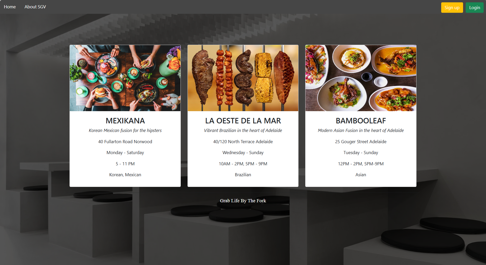
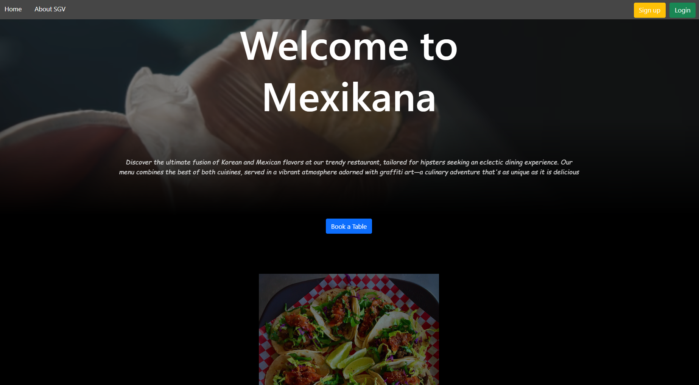

## Reservation-restaurant


### Overview
Reservation-restaurant is a collaborative web application designed for managing restaurant reservations, seating arrangements, and customer interactions. The project leverages modern web technologies to deliver a seamless and efficient user experience for both restaurant staff and customers.






### Key Features
- **User Authentication**: Secure user registration and login using JSON Web Tokens (JWT).
- **Reservation Management**: Create, view, and manage reservations with details such as date, time, party size, and special requests.
- **Seating Arrangements**: Visual interface for managing table availability and seating arrangements.
- **Customer Interaction**: Real-time notifications and reminders for customers about their reservations.
- **Admin Dashboard**: Comprehensive dashboard for restaurant staff to oversee and manage reservations, tables, and customer interactions.

### Technologies Used
- **Frontend**: React.js, Redux, HTML, CSS, JavaScript
- **Backend**: Node.js, Express.js
- **Database**: SqlLite
- **Authentication**: JSON Web Tokens (JWT)
- **Version Control**: Git, GitHub

### Getting Started
To get a local copy of the project up and running, follow these simple steps:

#### Prerequisites
- Node.js
- npm

#### Installation
1. **Clone the repository**:
   ```bash
   git clone https://github.com/Freaky128/Project-Studio.git
   ```
2. **Navigate to the project directory**:
   ```bash
   cd Project-Studio
   ```
3. **Install dependencies**:
   ```bash
   npm install
   ```
4. **Start the development server**:
   ```bash
   npm start
   ```

#### Contributors:
-Matthew Freak  
-Duy Quoc Anh Nguyen 
-Vanessa Tran
-Antonio Arar
